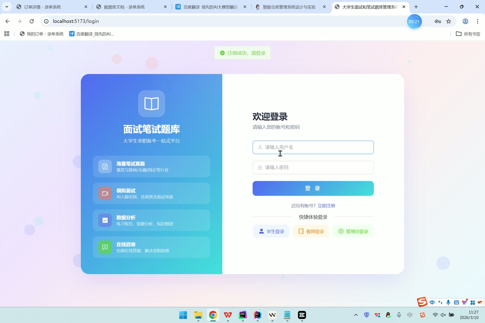
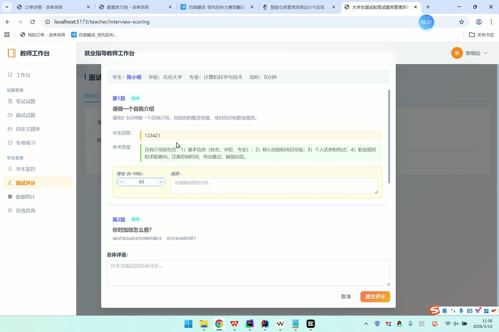
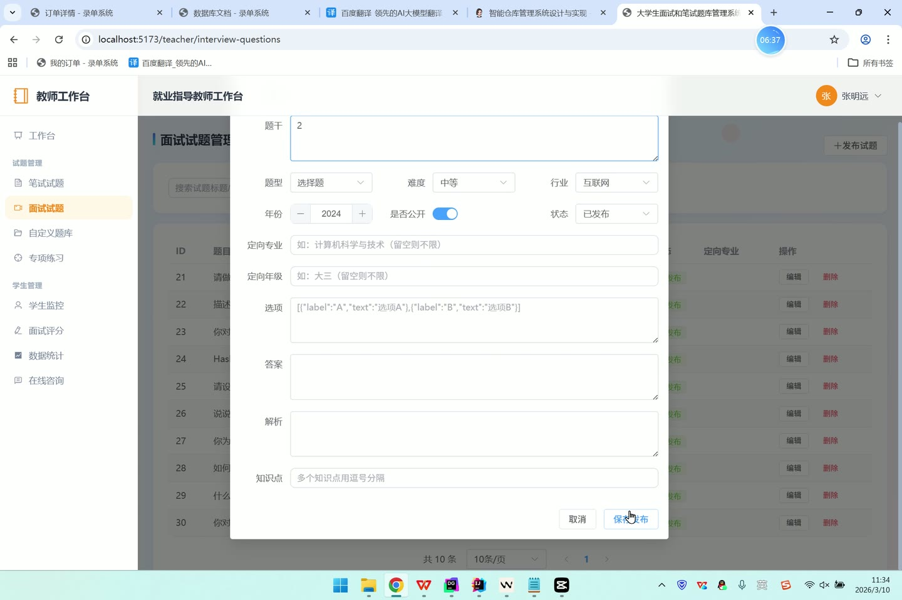

# (附文档)Springboot3+Vue3+MySQL 大学生面试和笔试题库管理系统

**技术栈**：Springboot3、Vue3、MySQL

### 系统简介

本系统是一套基于 SpringBoot3 + Vue3 + MySQL 构建的面试与笔试题库管理平台，采用前后端分离架构。系统支持学生、教师、管理员三种角色，提供笔试/面试试题的浏览、练习、自动/人工评分、错题本、收藏、自定义题库、专项练习、师生咨询等完整功能链，同时包含后台用户管理、轮播图配置、操作日志与数据统计等管理功能。
 
### 核心功能
 
### 普通用户端

 
- 注册与登录：支持用户名密码注册、登录，登录失败超5次自动冻结账号，支持管理员一键重置密码为123456 
- 快捷登录：选择角色一键登录，无需密码即可快速进入系统 
- 笔试试题浏览：按考试类型（笔试）、题型、行业、难度、年份、知识点关键词筛选试题列表，支持分页 
- 面试试题浏览：按考试类型（面试）、题型、行业、难度、年份、知识点关键词筛选试题列表，支持分页 
- 试题详情查看：点击试题查看完整题目、选项、参考答案与解析 
- 笔试练习：随机抽取指定数量笔试题目进行作答，提交后系统自动判对错并计算分数（百分制） 
- 面试练习：随机抽取指定数量面试题目，提交后不自动评分，等待教师人工评阅 
- 练习记录查看：按考试类型筛选个人练习记录列表，点击查看每道题的作答详情、标准答案、教师评分与评语 
- 错题本：笔试练习中答错的题目自动进入错题本，记录错误答案与错误次数，支持按知识点筛选与单条删除 
- 试题收藏：对任意试题进行收藏，可打标签分类，在收藏列表中查看收藏题目与对应试题详情，支持取消收藏 
- 专项练习：查看教师发布的专项练习列表，进入专项练习后作答该专项包含的所有试题 
- 在线咨询：学生创建咨询工单（标题+内容），教师回复后状态变为已回复，学生可查看教师回复内容 
- 个人信息管理：修改昵称、手机、邮箱、学校、专业、年级、头像、人脸照片等个人信息 
- 修改密码：输入原密码与新密码完成密码修改 
- 首页轮播图：查看管理员启用的轮播图列表，按排序顺序展示 
- 首页统计：查看公开的笔试题数量、面试题数量、总试题数量 
- 试题分类：查看试题分类列表（按排序顺序）
 
### 管理员端

 
- 用户管理：查看所有用户列表（按角色/关键词筛选），支持创建用户、编辑用户信息、删除用户 
- 用户状态管理：一键切换用户启用/冻结状态，冻结后用户无法登录 
- 重置用户密码：将指定用户密码重置为123456 
- 试题管理：查看所有试题列表（按考试类型/关键词筛选），支持新增/编辑/删除试题 
- 操作日志：查看系统操作日志列表（按时间倒序），记录操作人、操作内容、请求方法、IP地址 
- 轮播图管理：查看轮播图列表（按排序升序），支持新增、编辑、删除轮播图（标题、图片、链接、排序、状态） 
- 数据统计：查看总用户数、学生数、教师数、总试题数、笔试题数、面试题数、总练习次数、笔试/面试练习次数 
- 分数分布统计：按0-20、20-40、40-60、60-80、80-100五个分数段展示练习得分分布 
- 活跃学生统计：统计有练习记录的学生数量
 
### 教师端

 
- 我的试题管理：查看自己创建的试题列表（按考试类型/关键词筛选），支持新增/编辑/删除试题 
- 发布试题：创建新试题（设置标题、内容、题型、考试类型、行业、难度、年份、选项、答案、解析、知识点、是否公开、目标专业/年级等），发布后状态为启用 
- 自定义题库管理：创建/编辑/删除自定义题库（名称+描述），查看每个题库的试题数量 
- 题库添加试题：向自定义题库批量添加试题（按试题ID列表），支持从题库中移除指定试题 
- 查看题库试题：查看指定题库中的所有试题列表 
- 学生监控：查看学生列表（按姓名/专业/学校关键词筛选），展示每位学生的练习次数、总练习时长、平均得分 
- 查看学生练习记录：查看指定学生的所有练习记录列表（按考试类型筛选） 
- 查看学生练习详情：查看某条练习记录中每道题的作答内容、标准答案、教师评分与评语 
- 面试评分：对提交的面试练习记录进行人工评分，为每道面试题单独打分并填写评语，系统自动计算平均分作为总分 
- 待评分列表：查看所有未评分的面试练习记录，按时间倒序排列 
- 教师统计：查看我的试题数量、学生总数、总练习次数、笔试平均分、面试平均分 
- 专项练习管理：创建/编辑/删除专项练习（名称、描述、目标专业/年级），为专项练习添加或移除试题 
- 在线咨询回复：查看学生发起的咨询工单，填写回复内容并标记为已回复
 
### 技术栈

 后端框架Spring Boot 3.x ORMMyBatis-Plus 权限认证Spring Security + JWT（jjwt） 前端框架Vue 3 状态管理Pinia 构建工具Vite 数据库MySQL 8.x 分页插件MyBatis-Plus Pagination 文件上传MultipartFile + 本地存储
 
### 交付内容

 
- 后端完整源码 
- 前端完整源码 
- 数据库初始化脚本 
- 万字文档

## 界面展示

---

## 获取完整源码 + 万字文档

本仓库为项目介绍页。**完整前后端源码、数据库初始化脚本、万字项目文档**，请加微信 `kangkangcode`，或访问 [codekk.top](http://codekk.top) 获取。

可作课程设计 / 毕业设计参考，支持远程部署调试。